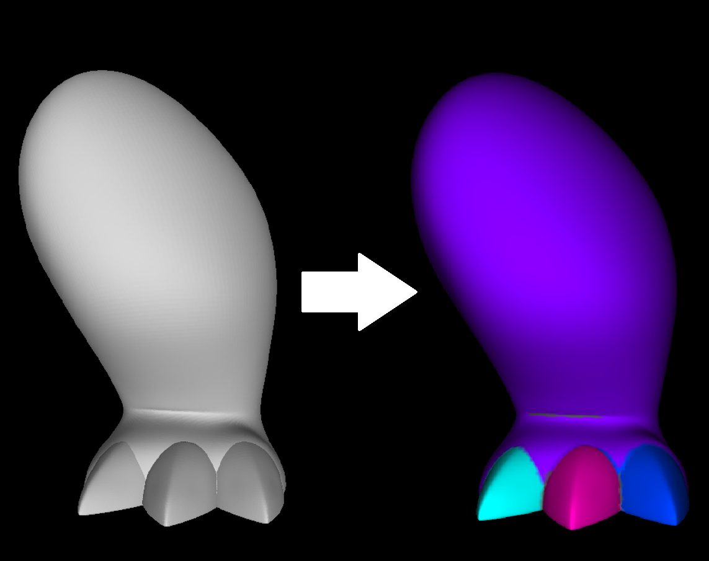

This project is a little mesh segmentation tool.
It tries to detect mesh parts based on curvature values computed at mesh vertices.
After computing curvature values vertex array is splitted into regions by min-cut graph algorithm.
There's a lot of space for improvement, though - blue and red vertices must be merged into close 'true' regions.

